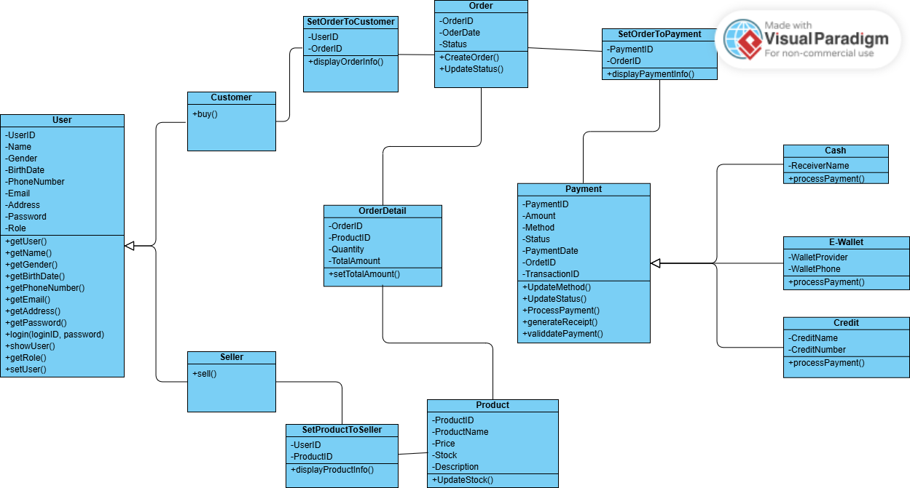
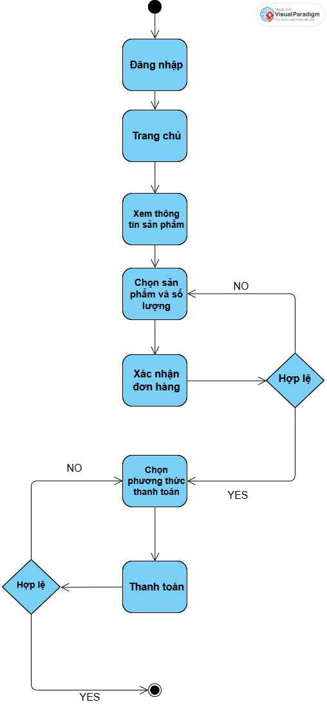
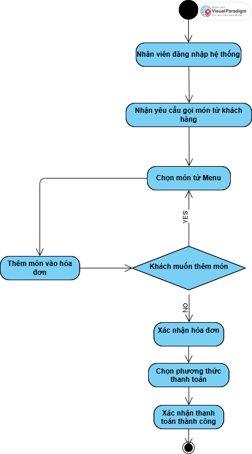
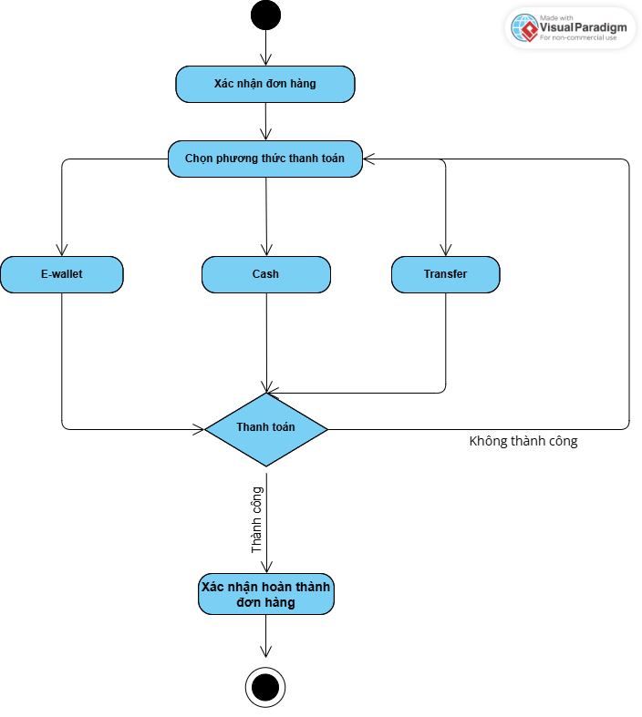
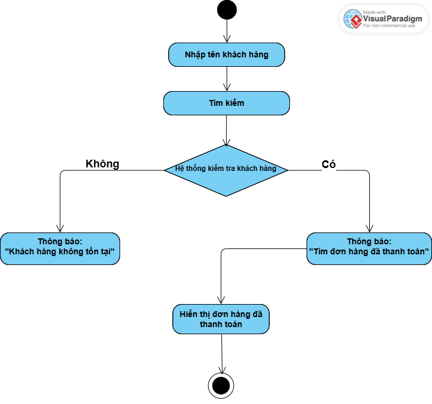
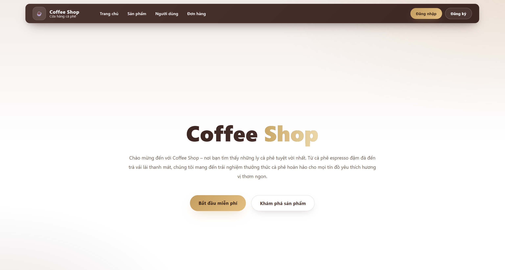

# 🚀 Hệ thống Quản lý Bán Cafe
> **Dự án cuối kỳ môn Lập trình Hướng Đối Tượng (OOP)**  
> Nhóm 10 – K18 – Term 3 – Năm học 2025  
> Giảng viên hướng dẫn: TS. Nguyễn Lệ Thu


Dự án **Hệ thống Quản lý Bán Cafe** được phát triển bằng ngôn ngữ Java, là bài tập lớn cho môn học Lập trình Hướng đối tượng (OOP). Ứng dụng cung cấp các chức năng cơ bản để quản lý sản phẩm, đơn hàng, khách hàng và kho hàng thông qua giao diện dòng lệnh (Console-based UI).

--- 
## 🎯 Giới thiệu

Mục tiêu của dự án là xây dựng một ứng dụng phần mềm hoàn chỉnh, áp dụng các nguyên tắc của lập trình hướng đối tượng (OOP) như tính đóng gói, kế thừa, đa hình và trừu tượng.

Hệ thống được thiết kế để giải quyết các bài toán cơ bản trong việc quản lý bán hàng, bao gồm quản lý sản phẩm, theo dõi đơn hàng, và kiểm soát hàng tồn kho. Với giao diện dòng lệnh (console) đơn giản và thân thiện, ứng dụng phù hợp cho mục đích học tập và có thể dễ dàng mở rộng, phát triển thêm các tính năng nâng cao trong tương lai.

--- 
## 📖 Mục lục

- [🚀 Hệ thống Quản lý Bán Cafe](#-hệ-thống-quản-lý-bán-cafe)
  - [🎯 Giới thiệu](#-giới-thiệu)
  - [📖 Mục lục](#-mục-lục)
  - [👥 Thành viên nhóm](#-thành-viên-nhóm)
  - [🏗️ Phân tích và Thiết kế](#️-phân-tích-và-thiết-kế)
  - [📂 Cấu trúc Thư mục](#-cấu-trúc-thư-mục)
  - [✨ Tính năng chính](#-tính-năng-chính)
    - [👤 **Quản lý người dùng:**](#-quản-lý-người-dùng)
    - [📦 **Quản lý sản phẩm:**](#-quản-lý-sản-phẩm)
    - [🛒 **Quản lý đơn hàng:**](#-quản-lý-đơn-hàng)
    - [💳 **Quản lý thanh toán:**](#-quản-lý-thanh-toán)
    - [💾 **Lưu trữ dữ liệu:**](#-lưu-trữ-dữ-liệu)
  - [📊 Biểu đồ lớp (Class Diagram)](#-biểu-đồ-lớp-class-diagram)
  - [🔁 Biểu đồ hoạt động (Activity Diagram)](#-biểu-đồ-hoạt-động-activity-diagram)
    - [1. Đăng nhập](#1-đăng-nhập)
    - [2. Mua hàng](#2-mua-hàng)
    - [3. Bán hàng](#3-bán-hàng)
    - [4. Thanh toán](#4-thanh-toán)
    - [5. Tìm kiếm danh sách đơn hàng đã thanh toán của khách hàng cụ thể](#5-tìm-kiếm-danh-sách-đơn-hàng-đã-thanh-toán-của-khách-hàng-cụ-thể)
  - [🖼️ Giao diện chương trình (Console)](#️-giao-diện-chương-trình-console)
  - [💡 Công nghệ sử dụng](#-công-nghệ-sử-dụng)
  - [📚 Tài liệu tham khảo](#-tài-liệu-tham-khảo)


--- 

## 👥 Thành viên nhóm

| STT | Họ tên           | Mã sinh viên | GitHub                                             | Vai trò        |
|-----|------------------|-------------|----------------------------------------------------|----------------|
| 1   | Nguyễn Xuân Thắng| 24100529    | [nthagg03](https://github.com/nthagg03)           | Team Leader    |
| 2   | Vũ Văn Phương    | 24100373    | [mphw0312](https://github.com/mphw0312)           | Developer      |
| 3   | TS. Nguyễn Lệ Thu|             | [nglthu](https://github.com/nglthu)               | Giảng viên     |

--- 

## 🏗️ Phân tích và Thiết kế

Dưới đây là cấu trúc các đối tượng chính trong hệ thống:

<details>
<summary><strong>👤 Người dùng (User)</strong></summary>

**Thuộc tính:**
- `userId`: ID người dùng (Khóa chính)
- `username`: Tên đăng nhập
- `password`: Mật khẩu (đã được mã hóa)
- `fullName`: Họ và tên
- `email`: Email liên hệ
- `phoneNumber`: Số điện thoại
- `role`: Vai trò (`ADMIN`, `USER`)
- `isActive`: Trạng thái hoạt động
- `createdDate`: Ngày tạo tài khoản

**Phương thức:**
- `login()`: Đăng nhập vào hệ thống
- `logout()`: Đăng xuất khỏi hệ thống
- `updateProfile()`: Cập nhật thông tin cá nhân
- `changePassword()`: Thay đổi mật khẩu

</details>

<details>
<summary><strong>📦 Sản phẩm (Product)</strong></summary>

**Thuộc tính:**
- `productId`: ID sản phẩm (Khóa chính)
- `productName`: Tên sản phẩm
- `description`: Mô tả sản phẩm
- `salePrice`: Giá bán
- `categoryId`: ID danh mục sản phẩm
- `barcode`: Mã vạch sản phẩm
- `createdDate`: Ngày tạo sản phẩm

**Phương thức:**
- `addProduct()`: Thêm sản phẩm mới
- `updateProduct()`: Cập nhật thông tin sản phẩm
- `deleteProduct()`: Xóa sản phẩm
- `searchProduct()`: Tìm kiếm sản phẩm
- `checkStock()`: Kiểm tra tồn kho

</details>

<details>
<summary><strong>🛒 Đơn hàng (Order)</strong></summary>

**Thuộc tính:**
- `orderId`: ID đơn hàng (Khóa chính)
- `customerId`: ID khách hàng
- `staffId`: ID nhân viên tạo đơn
- `orderDate`: Ngày tạo đơn hàng
- `totalAmount`: Tổng tiền trước thuế
- `taxAmount`: Tiền thuế
- `discountAmount`: Tiền giảm giá
- `finalAmount`: Tổng tiền cuối cùng
- `status`: Trạng thái (`PENDING`, `CONFIRMED`, `CANCELLED`, `COMPLETED`)
- `orderItems`: Danh sách sản phẩm trong đơn hàng

**Phương thức:**
- `createOrder()`: Tạo đơn hàng mới
- `addItem()`: Thêm sản phẩm vào đơn hàng
- `removeItem()`: Xóa sản phẩm khỏi đơn hàng
- `updateQuantity()`: Cập nhật số lượng sản phẩm
- `calculateTotal()`: Tính tổng tiền đơn hàng
- `cancelOrder()`: Hủy đơn hàng

</details>

<details>
<summary><strong>💳 Thanh toán (Payment)</strong></summary>

**Thuộc tính:**
- `paymentId`: ID thanh toán (Khóa chính)
- `orderId`: ID đơn hàng (Khóa ngoại)
- `paymentMethod`: Phương thức thanh toán (`CASH`, `E-WALLET`, `CREDIT_CARD`)
- `amount`: Số tiền thanh toán
- `paidAmount`: Số tiền đã trả
- `changeAmount`: Tiền thừa trả lại
- `paymentDate`: Ngày thanh toán
- `status`: Trạng thái (`PENDING`, `COMPLETED`, `FAILED`, `REFUNDED`)
- `transactionId`: Mã giao dịch

**Phương thức:**
- `processPayment()`: Xử lý thanh toán
- `refundPayment()`: Hoàn tiền
- `validdatePayment()`: Xác thực thanh toán
- `generateReceipt()`: Tạo hóa đơn thanh toán

</details>

<details>
<summary><strong>📊 Kho hàng (Inventory)</strong></summary>

**Thuộc tính:**
- `inventoryId`: ID kho hàng (Khóa chính)
- `productId`: ID sản phẩm (Khóa ngoại)
- `currentStock`: Số lượng hiện tại
- `minStock`: Số lượng tối thiểu
- `maxStock`: Số lượng tối đa
- `lastUpdated`: Ngày cập nhật cuối
- `location`: Vị trí trong kho
- `supplierId`: ID nhà cung cấp
- `costPrice`: Giá vốn trung bình

**Phương thức:**
- `updateStock()`: Cập nhật số lượng tồn kho
- `checkLowStock()`: Kiểm tra hàng sắp hết
- `generateStockReport()`: Tạo báo cáo tồn kho
- `importGoods()`: Nhập hàng vào kho
- `exportGoods()`: Xuất hàng từ kho
- `stockTaking()`: Kiểm kê hàng hóa

</details>

--- 

## 📂 Cấu trúc Thư mục

```plaintext
Project/
 ├─ banHang/
 │   ├─ bin/ 
 │   ├─ Review/                                                                 # File bài tập
 │   ├─ src/                                                                    # Mã nguồn chính xây dựng từ đầu đến bây giờ
 │   │   ├─ Customer.java
 │   │   ├─ CustomerOrder.java
 │   │   ├─ Inventory.java
 │   │   ├─ ListCustomerOrder.java
 │   │   ├─ Main.java
 │   │   ├─ ...
 │   ├─ test/                                                                   # Thư mục chứa các lớp kiểm thử thủ công
 │   │   ├─ testCustomerOrder.java
 │   │   ├─ testInventory.java
 │   │   ├─ testOrder.java
 │   │   ├─ ...
 ├─ gs-serving-web-content/
 │   ├─ complete/
 │   │   ├─ src/
 │   │   │   ├── main/                                                          # Chứa mô hình MVC
 │   │   │   │   ├── java/com/example/servingwebcontent                         
 │   │   │   │   │                    ├── controller/                           # Các controller
 │   │   │   │   │                    ├── database/                             # Các service, kết nối, truy vấn cơ sở dữ liệu
 │   │   │   │   │                    ├── model/                                # Các class mô hình dữ liệu
 │   │   │   │   │                    └── WebServingContentApplication.java     # Main() để chạy ứng dụng
 │   │   │   │   └── resources/
 │   │   │   │        ├── static/                                               
 │   │   │   │        ├── templates/                                            # Giao diện
 │   │   │   │        └── application.properties                                # File cấu hình ứng dụng
 │   │   │   └── test/java/com/example/servingwebcontent                        
 │   │   │       └── WebServingContentApplicationTest.java                      # Test ứng dụng
 │   │   └── ...
 │   ├─ initial/
 │   ├─ ...
 ├─ Image/                                                                      # File chứa ảnh của dự án
README.md                                                                       # Tài liệu mô tả dự án 
```

--- 
## ✨ Tính năng chính

### 👤 **Quản lý người dùng:**
-  **Thêm / Sửa / Xóa người dùng**
-  **Lọc theo loại:** Khách hàng (Customer), Nhà cung cấp (Seller)
-  **Phân quyền:** Admin, Manager, Staff
-  **Hiển thị danh sách người dùng theo vai trò**

### 📦 **Quản lý sản phẩm:**
-  **Thêm / Sửa / Xóa sản phẩm**
-  **Gán sản phẩm cho nhà cung cấp**
-  **Cập nhật số lượng sản phẩm sau mỗi đơn hàng**
-  **Tìm kiếm sản phẩm theo tên, mã, danh mục**
-  **Quản lý giá nhập, giá bán**

### 🛒 **Quản lý đơn hàng:**
-  **Tạo / Cập nhật đơn hàng**
-  **Hiển thị danh sách đơn hàng**
-  **Gán đơn hàng cho khách hàng và thanh toán**
-  **Tính tổng tiền đơn hàng (bao gồm thuế, giảm giá)**
-  **Theo dõi trạng thái đơn hàng**

### 💳 **Quản lý thanh toán:**
-  **Tạo và cập nhật thanh toán**
-  **Hiển thị thông tin thanh toán chi tiết**
-  **Cập nhật trạng thái, phương thức thanh toán**
-  **Hỗ trợ nhiều hình thức:** Cash, E-wallet, Credit
-  **Tạo hóa đơn điện tử**

### 💾 **Lưu trữ dữ liệu:**
-  **Dữ liệu được lưu vào file nhị phân**
-  **Sử dụng `ObjectOutputStream`, `ObjectInputStream`**
-  **Áp dụng `ArrayList`, `Map`, `HashMap` để quản lý dữ liệu trong bộ nhớ**
-  **Backup và restore dữ liệu tự động**

--- 

## 📊 Biểu đồ lớp (Class Diagram)


--- 

## 🔁 Biểu đồ hoạt động (Activity Diagram)

### 1. Đăng nhập


### 2. Mua hàng 



### 3. Bán hàng



### 4. Thanh toán



### 5. Tìm kiếm danh sách đơn hàng đã thanh toán của khách hàng cụ thể 



--- 

## 🖼️ Giao diện chương trình (Console)


--- 

## 💡 Công nghệ sử dụng

- Ngôn ngữ lập trình: **Java**
- Mô hình hướng đối tượng (OOP)
- **Framework**: [Spring Boot](https://spring.io/projects/spring-boot)
  - Quản lý luồng xử lý, cấu trúc theo mô hình MVC
- Giao diện: Console (text-based)
- Lưu trữ: File nhị phân 
- Cấu trúc dữ liệu: `ArrayList`, `LinkedList`, `Map`,...

--- 

## 📚 Tài liệu tham khảo

- Slide bài giảng môn Lập trình Hướng Đối Tượng – GVHD: Nguyễn Lệ Thu
- Java Docs – Oracle
- Stack Overflow – Community

--- 

> © 2025 Nhóm 10    
> *Hệ thống mua bán cà phê trực tuyến – Mã nguồn mở cho mục đích học tập*
